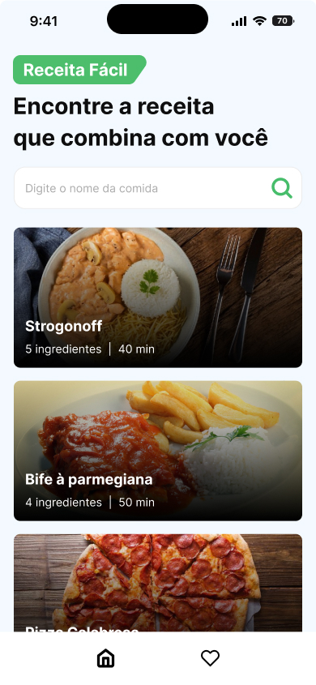

# Receitas Fáceis

## Workshop React Native Insider

 

## 📖 Informações

Este aplicativo mobile foi desenvolvido durante os dias do Workshop React Native Insider promovido pelo <a href="https://www.youtube.com/@Sujeitoprogramador"> Sujeito Programador</a>. O App tem a função de encontrar receitas fáceis para serem feitas e você pode favoritá-las!

  

## 🚀 Tecnologias

Este aplicativo foi desenvolvido utilizando as seguintes tecnologias:

- React Native
- Expo
- JavaScript
- Json Server
- Git e Github
- Figma

## 🔗 Links úteis

- <a href="https://www.youtube.com/@Sujeitoprogramador">Youtube</a>
- <a href="https://reactnavigation.org/">React Navigation</a>
